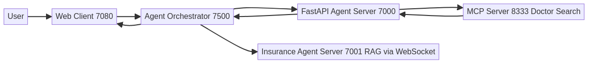
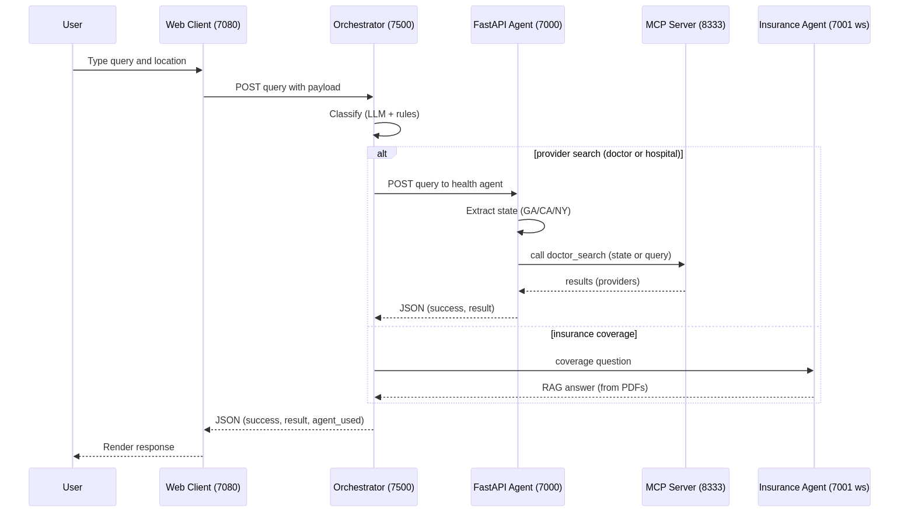

# Multi-Agent AI Healthcare & Insurance System

A comprehensive multi-agent AI system that provides healthcare information and insurance coverage assistance through intelligent agents with RAG (Retrieval-Augmented Generation) capabilities.

## 🏗️ System Architecture

The system consists of five main services:

### 🔍 **MCP Server** (Port 8333)
- **Purpose**: Doctor search API using Model Context Protocol
- **Technology**: FastMCP with OpenAI integration
- **Endpoints**: Doctor search, server information
- **Container**: `multi-agent-mcpserver`

### 🏥 **FastAPI Agent Server** (Port 7000)
- **Purpose**: Healthcare agent API with state extraction
- **Technology**: FastAPI with intelligent state parsing
- **Features**: 
  - State code extraction from natural language
  - Query processing and routing
  - Integration with MCP server
- **Container**: `multi-agent-server`

### 🛡️ **Insurance Agent Server** (Port 7001)
- **Purpose**: Insurance coverage assistant with RAG
- **Technology**: ACP SDK with CrewAI integration
- **Features**:
  - PDF document ingestion for policy analysis
  - RAG-based coverage determination
  - CrewAI agent for intelligent responses
  - WebSocket-based communication
- **Container**: `multi-agent-insurance-server`

### 🌐 **Web Client** (Port 7080)
- **Purpose**: Interactive chat interface
- **Technology**: FastAPI + HTML/JavaScript
- **Features**: Location-based healthcare queries
- **Container**: `multi-agent-webclient`

### 🧠 **Agent Orchestrator** (Port 7500)
- **Purpose**: Smart router that classifies each user query and forwards it to the right downstream service
- **Technology**: FastAPI + AutoGen (LLM router) + rule-based fallback
- **Features**:
  - Classifies queries as healthcare provider search vs. insurance coverage
  - Routes to the Healthcare FastAPI Agent (HTTP) or Insurance Agent (WebSocket)
  - Exposes a unified `/query` endpoint and service status under `/agents/status`
  - Strict environment handling (requires `OPENAI_API_KEY`)
- **Container**: `multi-agent-orchestrator`

## 🗺️ Workflow Diagram

The diagram below shows how a user query flows through the system, with the Agent Orchestrator classifying and routing requests. Static PNGs are embedded for environments that don't render Mermaid.




And the same flow as an interaction timeline:




To (re)generate the static PNGs used above:

- Using Docker (recommended for consistency):

```bash
./scripts/render-diagrams.sh
```

- Or using Node/npm (no Docker required):

```bash
# install dev dependency locally
npm install

# render via npm script
npm run render:diagrams

# or directly with npx
./scripts/render-diagrams-npm.sh
```
```

Notes
- Ports: MCP 8333, FastAPI 7000, Insurance 7001 (WebSocket), Web Client 7080.
- The Insurance Agent Server indexes PDF policies on startup and answers via RAG.
- The FastAPI Agent extracts state codes (e.g., "Atlanta, GA" → GA) and routes accordingly.

## �🚀 Quick Start

### Prerequisites
- Docker & Docker Compose
- OpenAI API Key
- Python 3.12+ (for local development)

### 1. Clone Repository
```bash
git clone <repository-url>
cd multi-agent-ai
```

### 2. Environment Setup
```bash
# Create .env file
echo "OPENAI_API_KEY=your_openai_api_key_here" > .env
```

### 3. Start All Services
```bash
# Build and start all services
docker-compose up --build

# Or use the build script
./scripts/build.sh
```

### 4. Access Services
- **Web Interface**: http://localhost:7080
- **Healthcare API**: http://localhost:7000
- **Insurance API**: ws://localhost:7001 (WebSocket)
- **MCP Server**: http://localhost:8333
- **Agent Orchestrator**: http://localhost:7500

## 🧭 Agent Orchestrator

The Agent Orchestrator is the single entry point that decides whether a query is about finding a healthcare provider or about insurance coverage.

### What it does
- Combines LLM-based classification (AutoGen) with a robust rule-based fallback for reliability.
- Prioritizes provider-seeking with location patterns (e.g., "doctor near me that accepts my plan").
- Recognizes strong insurance phrases (e.g., "does my plan cover …", "insurance reimbursement …").
- Returns the agent used, a confidence score, and short reasoning with every response.

### Ports and URLs
- Orchestrator HTTP: http://localhost:7500
- Downstream Health Agent: `FASTAPI_SERVER_URL` (default http://server:7000)
- Downstream Insurance Agent (WebSocket): `INSURANCE_SERVER_URL` (default ws://insurance-server:7001)
- MCP Server (doctor search): `MCP_SERVER_URL` (default http://mcpserver:8333)

### Environment Variables
- `OPENAI_API_KEY` (required) – Orchestrator will fail fast with a clear error if missing.
- `FASTAPI_SERVER_URL` – URL to the healthcare FastAPI Agent.
- `INSURANCE_SERVER_URL` – WebSocket URL to the Insurance Agent.
- `MCP_SERVER_URL` – URL to the MCP Server.

### Endpoints
- `GET /health` – Basic service health and downstream URLs.
- `POST /query` – Classify + route the query, returns a unified response.
- `GET /agents/status` – Pings downstream services (HTTP); marks insurance as "websocket - not tested".

### Request/Response Shapes
- POST `/query` body:
  - `location` (string)
  - `query` (string, required; non-empty)
  - `agent` (string, optional): one of `auto` (default), `doctor|health`, `insurance`
- Response fields:
  - `result` (string)
  - `success` (bool)
  - `agent_used` (string)
  - `confidence` (float)
  - `reasoning` (string)

### Examples

Provider search (doctor):

```bash
curl -s -X POST http://localhost:7500/query \
  -H "Content-Type: application/json" \
  -d '{
    "location": "Atlanta, GA",
    "query": "find cardiologist near me that accepts my plan",
    "agent": "auto"
  }'
```

Insurance coverage question:

```bash
curl -s -X POST http://localhost:7500/query \
  -H "Content-Type: application/json" \
  -d '{
    "location": "",
    "query": "does my plan cover cardiologist visits?",
    "agent": "auto"
  }'
```

Force a specific agent:

```bash
curl -s -X POST http://localhost:7500/query \
  -H "Content-Type: application/json" \
  -d '{
    "location": "NYC, NY",
    "query": "find pediatrician",
    "agent": "doctor"
  }'
```

### Classification cheatsheet
- Provider seeking + location → HEALTH_DOCTOR (confidence ~0.8)
- Strong insurance phrase → INSURANCE (confidence ~0.8)
- Mixed query with “find/need/looking for” → HEALTH_DOCTOR (confidence ~0.7)
- Generic insurance keywords → INSURANCE (confidence ~0.7)
- Generic health keywords → HEALTH_DOCTOR (confidence ~0.7)
- No clear signals → Default to HEALTH_DOCTOR (confidence ~0.3)

## 📋 Service Management

### Using Docker Compose
```bash
# Start all services
docker-compose up -d

# Stop all services
docker-compose down

# View logs
docker-compose logs -f [service_name]

# Restart specific service
docker-compose restart [service_name]

# Check service status
docker-compose ps
```

### Using Service Manager Script
```bash
# Start specific service
./scripts/service-manager.sh start insurance-server

# View logs for specific service
./scripts/service-manager.sh logs server

# Show all service status
./scripts/service-manager.sh status

# List available services
./scripts/service-manager.sh list
```

## 🔧 Development Workflow

### Automated CI Pipeline
```bash
# Run complete pipeline (format, test, build, deploy)
./scripts/ci-pipeline.sh

# Skip specific steps
./scripts/ci-pipeline.sh --skip-tests --skip-build

# Custom commit message
./scripts/ci-pipeline.sh -m "feat: add new feature"
```

### Individual Scripts
```bash
# Format code
./scripts/format.sh

# Run tests
./scripts/test.sh

# Build services
./scripts/build.sh

# Quick git push
./scripts/quick-push.sh "commit message"
```

## 📄 Insurance Document Setup

The insurance agent uses RAG to analyze PDF policy documents:

### 1. Add Documents
```bash
# Create data directory (if not exists)
mkdir -p data

# Add your PDF policy documents
cp your_policy.pdf data/
cp health_insurance.pdf data/
cp dental_coverage.pdf data/
```

### 2. Supported Document Types
- Health insurance policies
- Dental coverage documents
- Vision benefit plans
- Any insurance-related PDFs

### 3. Document Processing
- Documents are automatically indexed on server startup
- RAG tool creates embeddings for semantic search
- Agent uses document content to answer coverage questions

## 🏥 Healthcare Features

### State Extraction
The system intelligently extracts US state codes from natural language:

```javascript
// Examples that work:
"Find doctors in CA" → "CA"
"Looking for doctors in New York" → "NY"
"I live in Texas" → "TX"
"Find cardiologists in Atlanta, GA" → "GA"
```

### Supported Patterns
- Full state names: "California", "New York", "Texas"
- State codes: "CA", "NY", "TX"
- Common phrases: "in CA", "doctors in NY", "live in TX"
- Location context: "Atlanta, GA", "Miami, FL"

### Query Processing
1. **Input**: Natural language query with location
2. **Processing**: State extraction and query parsing
3. **Routing**: Forward to appropriate MCP server endpoint
4. **Response**: Formatted healthcare information

## 🧪 Testing

### Run All Tests
```bash
# Using test script
./scripts/test.sh

# Using pytest directly
python -m pytest tests/ -v

# Run specific test file
python -m pytest tests/test_fastapi_agent_server.py -v
```

### Test Coverage
- **FastAPI Agent Server**: State extraction, endpoint validation
- **MCP Server**: Doctor search functionality
- **Web Client**: UI interaction and API integration
- **Insurance Server**: RAG processing and agent responses

## 📚 API Documentation

### Healthcare Agent API (Port 7000)

#### Health Check
```bash
curl http://localhost:7000/health
```

#### Query Healthcare Information
```bash
curl -X POST http://localhost:7000/query \
  -H "Content-Type: application/json" \
  -d '{
    "location": "Atlanta, GA",
    "query": "Find cardiologists near me",
    "agent": "hospital"
  }'
```

### Insurance Agent API (Port 7001)

The insurance agent uses WebSocket communication through the ACP SDK:

#### Connect via WebSocket
```javascript
// WebSocket connection example
const ws = new WebSocket('ws://localhost:7001');

ws.onopen = function() {
    // Send insurance query
    ws.send(JSON.stringify({
        type: "message",
        content: "Is dental cleaning covered under my policy?"
    }));
};

ws.onmessage = function(event) {
    const response = JSON.parse(event.data);
    console.log('Insurance agent response:', response);
};
```

#### Health Check
```bash
# Check if service is running (socket connection test)
python -c "import socket; s=socket.socket(); s.connect(('localhost', 7001)); s.close(); print('Insurance server is running')"
```

### MCP Server API (Port 8333)

#### Server Information
```bash
curl http://localhost:8333/
```

#### Doctor Search
```bash
curl -X POST http://localhost:8333/ \
  -H "Content-Type: application/json" \
  -d '{
    "jsonrpc": "2.0",
    "id": 1,
    "method": "tools/call",
    "params": {
      "name": "doctor_search",
      "arguments": {"state": "CA"}
    }
  }'
```

## 🔨 Development Setup

### Local Development
```bash
# Install dependencies
uv sync

# Run specific service locally
uv run python server/fastapi_agent_server.py
uv run python server/mcpserver.py
uv run python server/insurance_agent_server.py
uv run python client/web_client.py
```

### Code Quality
```bash
# Format code
black . --line-length 88
isort . --profile black

# Type checking
mypy server/ client/

# Linting
flake8 server/ client/
```

## 🐳 Docker Configuration

### Build Arguments
- `SERVICE_TYPE`: Determines which service to run
  - `mcp-server`: MCP server
  - `fastapi-server`: Healthcare agent server
  - `insurance-server`: Insurance agent server
  - `web-client`: Web interface

### Environment Variables
- `OPENAI_API_KEY`: Required for all AI services
- `SERVICE_TYPE`: Service routing in entrypoint
- `SERVER_URL`: Backend server URL for web client
- `INSURANCE_SERVER_URL`: Insurance server URL for web client
- `MCP_SERVER_URL`: MCP server URL for FastAPI server

### Health Checks
Services include health checks for monitoring:
- **MCP Server**: HTTP health endpoint
- **FastAPI Server**: HTTP health endpoint
- **Web Client**: HTTP health endpoint
- **Insurance Server**: Socket connection test
- **Interval**: 30 seconds
- **Timeout**: 10 seconds
- **Retries**: 3 attempts

## 🔍 Troubleshooting

### Common Issues

#### Service Won't Start
```bash
# Check logs
docker-compose logs [service_name]

# Rebuild service
docker-compose build [service_name]

# Force recreate
docker-compose up --force-recreate [service_name]
```

#### Health Check Failures
```bash
# Check if service is responding
curl http://localhost:[port]/health  # For HTTP services

# Test socket connection for insurance server
python -c "import socket; s=socket.socket(); s.connect(('localhost', 7001)); s.close()"

# Verify environment variables
docker-compose exec [service_name] env

# Check port binding
docker-compose ps
```

#### Insurance Server Issues
```bash
# Verify PDF documents are mounted
docker-compose exec insurance-server ls -la /app/data/

# Check OpenAI API key
docker-compose exec insurance-server echo $OPENAI_API_KEY

# View detailed logs
docker-compose logs -f insurance-server

# Test WebSocket connection
wscat -c ws://localhost:7001
```

### Network Issues
```bash
# Check network connectivity
docker network ls
docker network inspect multi-agent-ai_multi-agent-network

# Test inter-service communication
docker-compose exec webclient curl http://server:7000/health
```

## 📝 Contributing

### Code Style
- **Python**: Black formatting (88 character line length)
- **Imports**: isort with black profile
- **Type Hints**: Required for all functions
- **Documentation**: Docstrings for all public functions

### Git Workflow
```bash
# Use CI pipeline for automated workflow
./scripts/ci-pipeline.sh

# Manual workflow
git add .
git commit -m "feat: description of changes"
git push origin main
```

### Testing Requirements
- All new features must include tests
- Tests must pass before merging
- Maintain test coverage above 80%

## 📈 Monitoring & Observability

### Service Health
```bash
# Check all service status
./scripts/service-manager.sh status

# Individual service health
curl http://localhost:7000/health  # Healthcare
curl http://localhost:8333/health  # MCP
curl http://localhost:7080/        # Web Client

# Insurance server (socket test)
python -c "import socket; s=socket.socket(); s.connect(('localhost', 7001)); s.close(); print('OK')"
```

### Logs
```bash
# All services
docker-compose logs -f

# Specific service
docker-compose logs -f [service_name]

# Follow logs with timestamps
docker-compose logs -f -t [service_name]
```

## 🚀 Production Deployment

### Environment Configuration
```bash
# Production .env example
OPENAI_API_KEY=prod_api_key_here
ENVIRONMENT=production
LOG_LEVEL=INFO
```

### Scaling
```bash
# Scale specific services
docker-compose up --scale server=2 --scale insurance-server=2
```

### Security Considerations
- Use proper OpenAI API key management
- Configure network security groups
- Enable SSL/TLS for production deployments
- Regular security updates for base images
- Secure WebSocket connections for insurance server

## 📚 Additional Resources

- **FastAPI Documentation**: https://fastapi.tiangolo.com/
- **CrewAI Documentation**: https://docs.crewai.com/
- **ACP SDK Documentation**: [Add ACP SDK docs link]
- **Docker Compose Reference**: https://docs.docker.com/compose/
- **OpenAI API Reference**: https://platform.openai.com/docs/

## 📄 License

[Add your license information here]

## 🤝 Support

For issues and questions:
1. Check the troubleshooting section
2. Review service logs
3. Create an issue with detailed information
4. Include docker-compose logs and error messages
